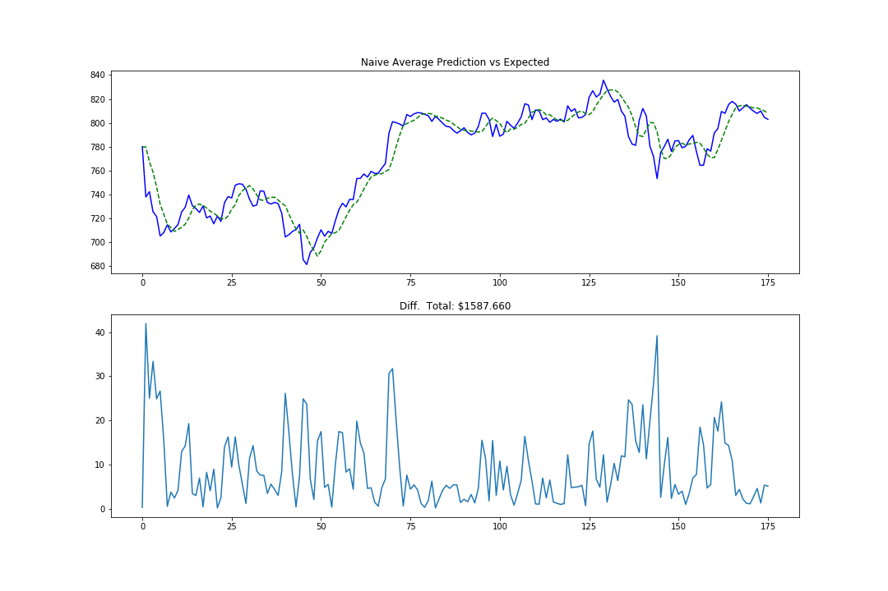
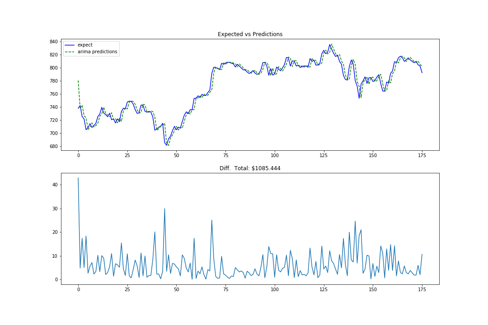
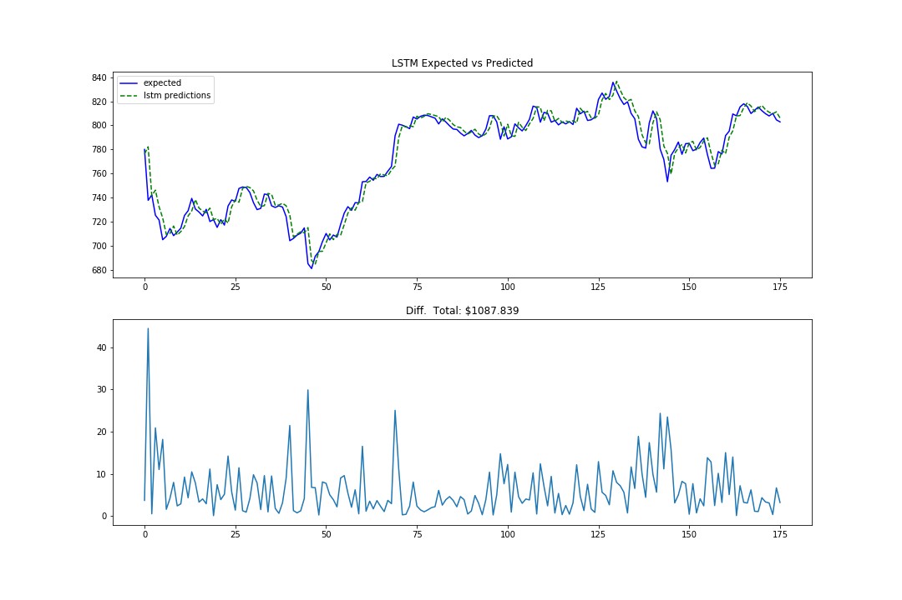

# Machine Learning Engineer Nanodegree

## Capstone Project

Quang Vu
April 2018

## Stock Price Prediction Capstone Project

## I. Definition

### Project Overview

Stock market price is both interesting and challenging to predict. Traditionally, it is analyzed with statistical model, then tested with series of back-testing, which is a process of applying the model with historical data to measure the performance of the model. This project aims to use a LSTM (Long Short Term Memory) model to automate that process, and measure how much information can be captured by the LSTM, and finally to compare it with current statistical model.

Overview of existing literature and tutorials:

- Predict Stock Price using RNN.[1]
- LSTM Neural Network for Time Series Prediction.[2]
- How to Create an ARIMA Model for Time Series Forecasting with Python [3]

### Problem Statement

The stock market has some properties on its data for each day: Open price, Close price, Adjusted price. In this project, I will use a RNN with LSTM to process a window interval (7 days, 30 days, etc...), and try to predict the closing stock price for the next day.

We will see if an LSTM model can make a better prediction than a naive guess and an ARIMA model. Given that training a RNN and LSTM is computationally expensive, we will also conduct an analysist on what advantage and disadvantage of using an LSTM. A brief review of how ARIMA and LSTM work will also be included, to show their relevance to the data that we had.

### Evaluation Metrics

With the goal of predicting stock price, our evaluation metric is to simply measure how far the prediction is, to the actual closing price on a given date. In this project, I pick a simple model, in which the difference is reported in form of absolute difference. That will make comparison between differenet implementations easier. However, in practical, an evaluation which takes into consideration of the direction of the price, would contribute more evaluation value. For example, if the model predicts an "x" amount increasement in price while the actual price is decreased, should have more penalty than the prediction of "x" amount less than actual price.


## II. Analysis

### Data Exploration

The New York Stock Exchange (NYSE) in 2010-2016 will be used for this project. The dataset can be downloaded on Kaggle (https://www.kaggle.com/dgawlik/nyse/data). The data is chosen because of the record of Open/Close/Low/High price for each day on the market during 2010-2016. In addition, there is also extra information about the securities price, splited-price, and the information about the company's earning, expense, profit... that can be served as extra parameters for the model. However, for this project, we will only use the closing data as training input.

### Exploratory Visualization

The data has stock price information of 501 companies, during the period of time between 2010 to 2016. For this project, we will only use closing stock price for Google.


We notice that there are some missing data on open business dates, such as: 2010-01-09, 2010-01-10, 2010-01-16, 2010-01-17, 2010-01-18... However, with those missing data, it is safe skip them during the process of constructing the time-window. The data has over 1700 entries, those missing values will not contribution significant difference to the result of method analysist. Furthermore, we conclude that we do not need to align time index for the goal of this project, so we decide to drop the time index to reduce the complexity during training and processing data.

We conduct a series of exploration on the data, with different time resolution, to find out if there is a autocorrelation coefficient. Here are the factors that we observer:

- For 2 months data, positive correlation is around 4-5 days.
- For 6 months data, positive correlation is around 15 days. For rare occasion, like 2012-2014, we have positive correlation on 2-3 months period.
- For 2 years data, correlation is around 100 days (3 months).
- For whole data, correlation is around 300 days( a year).


### Algorithms and Techniques

There a 3 different methods that we will compare: a naive averaging method, an ARIMA model, and a LSTM model prediction.

For the naive averaging method, the prediction is simple the average of previous _t_ days:

```python
price[t] = avarage(price[t-1] + price[t-2] + price[t-3]...)
```

ARIMA stands for Autoregressive Integrated Moving average. From our previous exploration, we determine that a 4-5 days windows would show the most correlation between the observations we have in our data. To construct an ARIMA model, we will use 4 days as a number of lack, and 1 as number of the degree of differencing in our model. The data will be split into train and test data. After we make prediction for day _t_, we will "roll" the actual data for date _t_ into our model before the next iteration of predictinng day _t+1_. This has a negative affect of our model has a power of correcting itself (for example: prediction for day _t+1_ will not carry the mistake the model make on previous day _t_). However, this will help making it more consistent with the algorithm we use for building LSTM model, and thus help us in comparison the two methods.

For consistency, we will also use 4 days window as a timestep for our LSTM model. The data will be splited in a sequence of 4-days window, with the value of the 5th day is the value the model needs to predict. A LSTM model is a special kind of RNN, which the output of one training is fed back into the network to train a next output. A LSTM is different than RNN that the former has more sophisticated way of control which input information it will take and which information it will keep.

For this project, we choose to use a stateful LSTM. A stateful model will retain its state beyond on training batch. This will help us demostrate that the window size, which is important in an ARIMA model, is not an important parameter in a LSTM model, as the model is capable of finding that relevant information by itself.

### Benchmark

With each method, we will calculate the difference between our actual result and the predictions. We will also collection information on how well our predictions follow the trend of the actual prices, as well as how much of the lag-behind the prediction follows the actual prices.


## III. Methodology
_(approx. 3-5 pages)_

### Data Preprocessing

Our data contains over 1700 entries between 2010-2016. We chose to split up 90% of the begining of the data to be used as training data. The 10% rest will be used as testing data to see how well the model can predict future price.

In Figure 1 which demostrate the visual of the data, we clearly notice that the data has upward increasing trend. In order to make the data stationary, we will either need to remove the trend, or pass in the degree of differencing for our ARIMA model. We choose to use the built-in feature in ARIMA model in `statsmodels` to handle the non-stationary data.

However, for our LSTM model, it performs poorly on the testing data. With the upward increasing price, the model is expected to predict the value which has never seen before. To overcome this problem, we choose to normalize our data in reference to the previous seen data. So, the model is expected to train and to predict base on the relative change of the price, instead of the absolute price value (ex: price increase 12%, 200%, 300%...). When we evaluate the model, we will denormalize the relative change back the the dollar value, so that we can make intuitive visual report and comparison.

### Implementation

Our main interest is to make sure we have a correct implementation for building the LSTM model. Even though LSTM is fully capable is doing multi-days predictions, the scenario in which the training data is a sequence with each item is of _n-length_, and the model will make a prediction of _n-length_ day into the future. Such scenario can give the model the future-bias, in which the model has hint about the future (in this case: _n1, n2..._) to predict _n0_. Instead, we choose to build our model to predict only 1 day into the future. The input shape that is passed through the LSTM cell is:

```sphinx
input_shape = (batch_size, timesteps, window_size)`
`batch_size`: the number of minibatch that is trained at the same time. We use only 1 batch_size be default.
`timesteps`: number of observations in one interval. We use 4, as observed in the data exploration.
`window_size`: we use 1 day prediction, as explain above.
```

The normalization is base on the last known value in previous training windows. For example, if our training data is split into a sequence such as:

```python
[
    [v0, v1, v2, v3],   # timestep 1
    [v1, v2, v3, v4],   # timestep 2
    [v2, v3, v3, v5],   # timestep 3
]
```

`timestep 3` will be normalized base on `v4`, `timestep 2` will be normalized base on `v3`, and `timestep 1` will be normalized base on `v0` as we do not have previous window info.

Another alternative to normalize data, is to use the last known value in _current_ window. So with the example above, `timestep 3` will be normalized base on `v5`. With this approach, when we make our prediction for _day[t]_, previous _day[t-1]_ will also have weight 0, and every other day will scale follows _day[t-1]_. After the normalization, `timestep 2` and `timestep 3` will have very different values even though they only shift one value. We want our model to able to pick the pattern (if any), so we favor the approach of using last known value in _previous_ window, so that we can preserve part of the weight pattern.

The normalization for one timestep is:

```python
window = [window[i] / previous_window[-1] - 1 for i in range(len(window))]
```

Consequencely, the formular for denormalize one normalized timestep is:

```python
window = [(1 + window[i]) * previous_window[-1] for i in range(len(window))]
```

For convenience, the values of `previous_window[-1]` are save as `normalizers`, for the process of normalizing and denormalizing.

The LSTM model is built with one single LSTM layer with 30 units, and a fully connected layer for output:

```text
Layer (type)                 Output Shape              Param #
=================================================================
lstm_1 (LSTM)               (1, 30)                   3840
_________________________________________________________________
dense_1 (Dense)             (1, 1)                    31
=================================================================
Total params: 3,871
Trainable params: 3,871
Non-trainable params: 0
_________________________________________________________________
```

### Refinement

We attempt to train both stateful LSTM model and stateless LSTM model. Both models converse rather quickly, indicating that the 4-days window is sufficient for LSTM to make prediction base on our data. It can also mean that there is no obvious pattern for the LSTM to discover through 4-days windows.

And since both model can converse really quickly (less than 3 epochs), we decide to add a dropout layer in the LSTM to make the model learn slower and avoid overfitting.


## IV. Results

### Model Evaluation and Validation

We expect our naive averaging to perform poorly, due to the simplistic solution, and due to the fact that the model will also regress to the mean. That means most of the time the model will go in the opposite direction of the current price's trend. A visual comparison confirms our expectation:



We expect the ARIMA model to perform well, as it is currently one of the best method to analyze time sequence data. The ARIMA model perform a little above our expectation. It closely follows the actual price. The margin of error is around 3%-4% ($20, $30 over $700).



The LSTM model performs equally well to the ARIMA model. Those two models have almost equally comparison on the difference, except that the LSTM model perform not as well as ARIMA when there is a sharp downward trend in the price.



### Justification

The result of the performance of the LSTM model shows that it has successfully captured the calculation for the closing price of the next day. While the ARIMA requires some analysist on the data to determine the parameters needed to initialize its model, the LSTM is able to optimize its model with very minimal initial configuration.

However, this result does not mean that we have successfully predicting the future. On the opposite, the overwhelmingly good performance is largely due to some issues:

- The data automatically corrects the model prediction. A wrong prediction on previous days are discarded, and replace with actual data in each prediction.
- The "pattern" that both ARIMA model and LSTM model use for calculation seems to be just carry on the price of current day onto the next day. This strategy works extremely well for a big and stable company like Google, where it is rarely to have big change in short amount of time such as one day. Also, Google is a very popular company, and is on trading strategy of many big financial firms. Any big price change would likely be put back to market equilibrum by the end of the day.


## V. Conclusion

### Reflection

A large portion of the project's time was put into handling time index, and into making sure all the entries are aligned properly throughout different implementations. While this is really important when handling time sequence data, it is not a critical part of the project. Throwing away time index and treating data as numpy sequence simplify many parts of data handling and data shaping. If the time index is still needed at the end of this project, it can still be re-aligned. This approach is more practical than introducing another data's attribute to training process of the LSTM model.

The LSTM is a very powerful technique, with very minimal setup. More time of the project was spent on understanding the theoritical underhood model, than to actually implementing and optimizing the model used in the project. Also, different tutorials and papers use different terminologies for time sequence and for model's parameters. The terminologies are similar, but have different meaning depend on the context of input data or model's expectation.

And due to the logic of keeping and throwing away "memory" of LSTM, it pushed me to develop domain knowledge in financing and stock trading. Thanks to some basic finance knowledge gained during the project, I was able to realize the limitation of the data when feeding them to LSTM model. While LSTM is great at extracting features out the previous context, timestamp alone does not contain much feature to be extracted and to help with the predicting ability.

### Improvement

While the result of the project can be skeptical, due to the issues mention in the "Justification" section, there are some aspects that we can implement for future project:

- The result of predictions should be combined. With the compounding error, we can avoid a problem in which the data correcting the prediction.
- There could be a better loss function, in which we can penalize the score more if the model make prediction in wrong direction. It is oftern more useful to predict if the price will go up or down, rather than will go up to which amount.
- The prediction can be return in form of price momentum, instead of specific dollar amount. It can help highlighting the potential for the price will go in certain direction, through a probability value instead of dollar value.
- We can utilize LSTM for evaluating multi-variables, such as finding a correlation between price moment in two or more companies. Time sequence does not show the causal inference to the stock price, because time does not cause the price to change, time only reflect the change of price. Relying time sequence analysist will not yeild a good performance for pricing, as we will know identify the causal connection. But with the way LSTM work by maintaining related features and throwing away un-related features, we can utilize it to process more information's dimension.


## References:

[1]: Weng, Lilian.  https://lilianweng.github.io/lil-log/2017/07/08/predict-stock-prices-using-RNN-part-1.html

[2]: Aungiers, Jakob.  http://www.jakob-aungiers.com/articles/a/LSTM-Neural-Network-for-Time-Series-Prediction

[3]: Brownlee, Jason. https://machinelearningmastery.com/arima-for-time-series-forecasting-with-python/